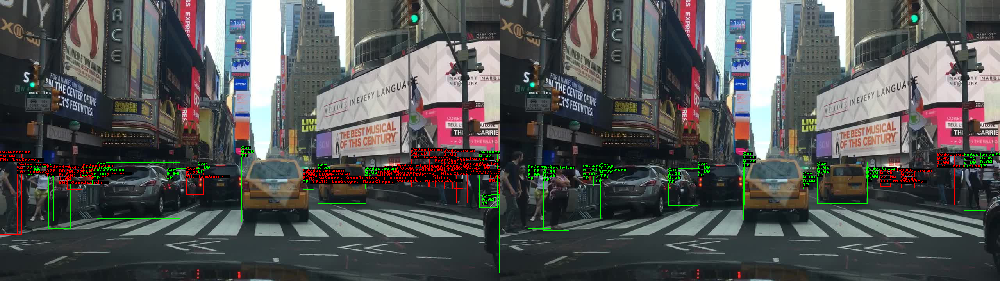

# RiskWeaver

A Domain Specific Language for the Specification of Risk-oriented Object Detection Requirements. Featuring:

* Relation-based Object Analysis
* Risk Factor Assessment
* Error Type Categorization
* Comprehensive Metrics
* Environment and Object Modeling
* Performance Evaluation Tools
* Data filtering
* Visualization

The formats of input/output data are based on [COCO](https://cocodataset.org/#format-data) and [COCO Results](https://cocodataset.org/#format-results).

## Getting Started

## Installation

1. Git clone the repository.
```bash
git clone https://github.com/jst-qaml/risk-weaver.git
```
2. Install the required packages using the following command:
```bash
#Install ghcup
curl --proto '=https' --tlsv1.2 -sSf https://get-ghcup.haskell.org | sh
#Install ghc and cabal
ghcup install ghc 9.6.3
ghcup set ghc 9.6.3
ghcup install cabal 3.10.2.0
ghcup set cabal 3.10.2.0
# Build the project
cabal update
cabal build all
cabal install
```
Then it installs risk-weaver-exe in the .cabal/bin directory.
When you update risk definision, you need to run the following command to update the risk-weaver-exe.

3. Generate a template code for the RiskWeaver DSL.
```bash
risk-weaver-exe generate-template > custom-risk-weaver.hs
```
4. Update risk definition(riskForGroundTruth and riskForDetection) in the generated template file.
5. Run the RiskWeaver code to generate the output.
```bash
# Build the updated code.
cabal exec ghc custom-risk-weaver.hs
# It outputs help message without any arguments.
Usage: risk-weaver-exe COMMAND

  coco command line tool

Available options:
  -h,--help                Show this help text

Available commands:
  list-images              list all images of coco file
  list-categories          list all categories of coco file
  list-annotations         list all annotations of coco file
  list-coco-result         list all coco result
  show-image               show image by sixel
  show-detection-image     show detection image by sixel
  evaluate                 evaluate coco result
  show-risk                show risk
  show-risk-with-error     show risk with error
  generate-risk-weighted-dataset
                           generate risk weighted dataset
  bash-completion          bash completion
  generate-template        generate template
```
Then use "custom-risk-weaver" command instead of risk-weaver-exe.

## Usage

You can reduce the risk of object detection by using the following steps:

1. Define the risk.
2. Run the model and output the result in COCO format.
3. Analyze the risk and visualize it, and if necessary, redefine the risk.
4. Fine-tune the model to reduce the risk.
5. Analyze the risk and visualize it.

### 1. Define the risk

You can define the risk in the custom-risk-weaver.hs file. 
The risk is defined in the riskForGroundTruth and riskForDetection functions to measure recall and precision.
Both functions return a list of Risk objects.

The default risk definition is as follows:
```haskell
  -- | Error type
  data ErrorType _
    = FalsePositive (Set SubErrorType)
    | FalseNegative (Set SubErrorType)
    | TruePositive
    | TrueNegative
    deriving (Ord, Eq, Generic, NFData)

  -- | The definition of risk
  data Risk _ = BddRisk
    { riskType :: ErrorType BoundingBoxGT, -- ^ Error type of the risk like FalsePositive, FalseNegative, TruePositive, TrueNegative
      risk :: Double, -- ^ Risk value for each object
      riskGt :: Maybe BoundingBoxGT, -- ^ The ground truth object of the risk value
      riskDt :: Maybe (Detection BoundingBoxGT) -- ^ The detected object of the risk value
    } deriving (Show, Ord, Eq, Generic, NFData)

  -- | Risk for ground truth: It is used to measure recall.
  riskForGroundTruth :: forall m. (Monad m) => ReaderT (Env BoundingBoxGT) m [Risk BoundingBoxGT]
  riskForGroundTruth = do
    env <- ask
    -- loopG is a function to iterate over all ground truth objects.
    loopG (++) [] $ \(gt :: a) ->
      -- whenInterestAreaG is a function to check if the ground truth object is in the interest area.
      whenInterestAreaG (envUseInterestArea env) gt $ do
        -- riskBias is a factor to adjust the risk value. In this case,
        -- the risk value is adjusted by 10 when the object is a pedestrian.
        let riskBias = if classG @BoundingBoxGT gt == Pedestrian then 10 else 1
        -- detectG finds the detected object corresponding to the ground truth object.
        case detectG env gt of
          -- If the detected object is found, it returns true positive and a low risk value(0.0001).
          Just (dt :: Detection a) ->
            return [BddRisk {riskGt = Just gt, riskDt = Just dt, risk = 0.0001, riskType = TruePositive}]
          -- If the detected object is not found, it returns false negative.
          Nothing -> do
            -- Find the detected object with the maximum IoU.
            case detectMaxIouG env gt of
              -- If the detected object is not found, it returns false negative and a high risk value(30).
              Nothing -> return [BddRisk {riskGt = Just gt, riskDt = Nothing, risk = riskBias * 30, riskType = FalseNegative []}]
              Just (dt :: Detection a) -> do
                case ( classD @BoundingBoxGT dt == classG @BoundingBoxGT gt, -- ^ Class match between ground truth and detection
                       scoreD @BoundingBoxGT dt > confidenceScoreThresh env, -- ^ If the confidence score of detection is higher than the threshold, it returns true.
                       ioU gt dt > ioUThresh env, -- ^ If the IoU of detection is higher than the threshold, it returns true. IoU is Intersection over Union.
                       ioG gt dt > ioUThresh env  -- ^ If the IoG of ground truth is higher than the threshold, it returns true. IoG is Intersection over Ground truth.
                     ) of
                  (False, False, False, True) -> return [BddRisk {riskGt = Just gt, riskDt = Just dt, risk = riskBias * 5.1, riskType = FalseNegative [MissClass, LowScore, Occulusion]}]
                  (False, False, True, _) -> return [BddRisk {riskGt = Just gt, riskDt = Just dt, risk = riskBias * 5, riskType = FalseNegative [MissClass, LowScore]}]
                  (False, True, False, True) -> return [BddRisk {riskGt = Just gt, riskDt = Just dt, risk = riskBias * 5.1, riskType = FalseNegative [MissClass, Occulusion]}]
                  (False, True, True, _) -> return [BddRisk {riskGt = Just gt, riskDt = Just dt, risk = riskBias * 2, riskType = FalseNegative [MissClass]}]
                  (True, False, False, True) -> return [BddRisk {riskGt = Just gt, riskDt = Just dt, risk = riskBias * 5.1, riskType = FalseNegative [LowScore, Occulusion]}]
                  (True, False, True, _) -> return [BddRisk {riskGt = Just gt, riskDt = Just dt, risk = riskBias * 5, riskType = FalseNegative [LowScore]}]
                  (True, True, False, True) -> return [BddRisk {riskGt = Just gt, riskDt = Just dt, risk = riskBias * 0.1, riskType = FalseNegative [Occulusion]}]
                  (True, True, True, _) -> return [BddRisk {riskGt = Just gt, riskDt = Just dt, risk = riskBias * 0.0001, riskType = TruePositive}]
                  (_, _, False, False) -> return [BddRisk {riskGt = Just gt, riskDt = Nothing, risk = riskBias * 30, riskType = FalseNegative []}]
```


### 2. Run the model and output the result in COCO format

Generate a coco result output for an analized model and test dataset.
At first you need to add the following codes to generate the output.
Next it outputs the result in COCO format.


```python
    coco_results = []
    model.eval()
    for images, targets in data_loader:
        images = list(img.to(device) for img in images)

        if torch.cuda.is_available():
            torch.cuda.synchronize()
        model_time = time.time()
        outputs = model(images)
        for (output,image,target) in zip(outputs,images,targets):
            for box, label, score in zip(output["boxes"],output["labels"],output["scores"]):
                [x0,y0,x1,y1] = box.tolist()
                coco_results.append({
                    "image_id": int(target["image_id"]),
                    "category_id": int(label),
                    "bbox": [x0,y0,x1-x0,y1-y0],
                    "score": float(score)
                })
    with open(output_json, "w") as outfile:
        outfile.write(json.dumps(coco_results, indent=4))
```

### 3. Analyze the risk and visualize it, and if necessary, redefine the risk

"risk-weaver-exe evaluate" command evaluates the risk and outputs the result in the following format.
It outputs AP, risk values, confusion matrix, and F1 scores.
AP and F1 output the average value of each category. mAP and mF1 output the average value of all categories.

In case of confusion matrix of recall, row is ground truth, column is prediction.
For example, when groundtruth's pedestrian is not detected and it is false negative, the value of the confusion matrix is 822.
When groundtruth's pedestrian is detected as pedestrian, the value of the confusion matrix is 4070.

In case of confusion matrix of precision, row is prediction, column is ground truth.
For example, when not existing pedestrian is detected as pedestrian and it is false positive, the value of the confusion matrix is 293.
When pedestrian is detected as pedestrian, the value of the confusion matrix is 3810.

Next "risk-weaver-exe generate-risk-weighted-dataset" command generates a risk weighted dataset.
It outputs the same format with the evaluate command, and it also outputs the risk weighted dataset in COCO format.

In this example, the number of groundtruth's pedestrian not detecting as pedestrian becomes 5159. The value is 822 in the original dataset.
The risk value changes from 511706.25 to 2357411.65. It is about 4 times larger than the original dataset.
Because the risk definition of groundtruth's pedestrian is 30 times larger than the other categories.

If the risk value does not increase as expected, redefine the risk definition.

```bash
$ risk-weaver-exe evaluate -s 0.4 -i 0.5 "coco annotation json file of ground truth" "coco result json file"
#CocoFile    , "coco annotation json file of ground truth"
#CocoResultFile, "coco result json file"
#Category   , AP
pedestrian  , 0.386
rider       , 0.274
car         , 0.731
truck       , 0.524
bus         , 0.561
train       , 0.000
motorcycle  , 0.261
bicycle     , 0.369
mAP         , 0.388

#Risk
total       , 511706.25
maximum     , 3158.00
average     , 148.28
minimum     , 0.00
90percentile, 415.10
num_of_images, 3451

#confusion matrix of recall: row is ground truth, column is prediction.
#GT \ DT    ,Backgroud   ,pedestrian  ,rider       ,car         ,truck       ,bus         ,train       ,motorcycle  ,bicycle     ,
pedestrian  ,822         ,4070        ,17          ,875         ,68          ,12          ,0           ,18          ,99          ,
rider       ,31          ,75          ,89          ,64          ,2           ,0           ,0           ,12          ,14          ,
car         ,1757        ,291         ,15          ,35683       ,271         ,64          ,0           ,36          ,134         ,
truck       ,149         ,21          ,1           ,360         ,939         ,30          ,0           ,2           ,8           ,
bus         ,48          ,14          ,2           ,172         ,59          ,380         ,0           ,0           ,4           ,
train       ,2           ,2           ,0           ,3           ,0           ,0           ,0           ,0           ,0           ,
motorcycle  ,20          ,14          ,5           ,70          ,7           ,0           ,0           ,53          ,12          ,
bicycle     ,50          ,54          ,7           ,109         ,4           ,1           ,0           ,5           ,205         ,

#confusion matrix of precision: row is prediction, column is ground truth.
#DT \ GT    ,Backgroud   ,pedestrian  ,rider       ,car         ,truck       ,bus         ,train       ,motorcycle  ,bicycle     ,
pedestrian  ,293         ,3810        ,38          ,100         ,11          ,1           ,2           ,2           ,12          ,
rider       ,0           ,7           ,102         ,4           ,0           ,0           ,0           ,1           ,0           ,
car         ,963         ,50          ,13          ,35256       ,245         ,77          ,0           ,12          ,16          ,
truck       ,42          ,10          ,0           ,210         ,1042        ,36          ,0           ,2           ,2           ,
bus         ,3           ,0           ,0           ,31          ,26          ,446         ,0           ,0           ,0           ,
train       ,0           ,0           ,0           ,0           ,0           ,0           ,0           ,0           ,0           ,
motorcycle  ,0           ,0           ,1           ,3           ,1           ,0           ,0           ,65          ,2           ,
bicycle     ,5           ,8           ,0           ,13          ,1           ,0           ,0           ,8           ,235         ,

#F1 Scores
pedestrian  , 0.432
rider       , 0.277
car         , 0.739
truck       , 0.585
bus         , 0.612
train       , 0.000
motorcycle  , 0.299
bicycle     , 0.364
mF1         , 0.413

$ risk-weaver-exe generate-risk-weighted-dataset -s 0.4 -i 0.5 "coco annotation json file of ground truth" "coco result json file" "risk weighted dataset json file"
#CocoFile    , "risk weighted dataset json file"
#CocoResultFile, 
#Category   , AP
pedestrian  , 0.324
rider       , 0.169
car         , 0.700
truck       , 0.514
bus         , 0.549
train       , 0.000
motorcycle  , 0.236
bicycle     , 0.330
mAP         , 0.353

#Risk
total       , 2357411.65
maximum     , 3158.00
average     , 683.11
minimum     , 2.00
90percentile, 1562.00
num_of_images, 3451

#confusion matrix of recall: row is ground truth, column is prediction.
#GT \ DT    ,Backgroud   ,pedestrian  ,rider       ,car         ,truck       ,bus         ,train       ,motorcycle  ,bicycle     ,
pedestrian  ,5159        ,17968       ,77          ,3100        ,267         ,60          ,0           ,52          ,471         ,
rider       ,122         ,267         ,150         ,97          ,5           ,0           ,0           ,15          ,64          ,
car         ,2234        ,844         ,10          ,31117       ,267         ,107         ,0           ,27          ,284         ,
truck       ,196         ,57          ,2           ,324         ,1115        ,57          ,0           ,0           ,35          ,
bus         ,108         ,44          ,0           ,218         ,70          ,587         ,0           ,0           ,6           ,
train       ,4           ,4           ,0           ,3           ,0           ,0           ,0           ,0           ,0           ,
motorcycle  ,25          ,41          ,5           ,93          ,7           ,0           ,0           ,80          ,24          ,
bicycle     ,154         ,165         ,18          ,215         ,28          ,4           ,0           ,20          ,495         ,

#confusion matrix of precision: row is prediction, column is ground truth.
#DT \ GT    ,Backgroud   ,pedestrian  ,rider       ,car         ,truck       ,bus         ,train       ,motorcycle  ,bicycle     ,
pedestrian  ,1492        ,16118       ,146         ,480         ,54          ,14          ,8           ,5           ,38          ,
rider       ,0           ,37          ,188         ,8           ,0           ,0           ,0           ,1           ,0           ,
car         ,794         ,126         ,18          ,30889       ,282         ,101         ,0           ,4           ,43          ,
truck       ,51          ,27          ,0           ,241         ,1261        ,56          ,0           ,1           ,19          ,
bus         ,10          ,0           ,0           ,38          ,46          ,664         ,0           ,0           ,0           ,
train       ,0           ,0           ,0           ,0           ,0           ,0           ,0           ,0           ,0           ,
motorcycle  ,0           ,0           ,0           ,4           ,1           ,0           ,0           ,89          ,3           ,
bicycle     ,14          ,33          ,0           ,19          ,3           ,0           ,0           ,27          ,526         ,

#F1 Scores
pedestrian  , 0.379
rider       , 0.167
car         , 0.713
truck       , 0.552
bus         , 0.595
train       , 0.000
motorcycle  , 0.253
bicycle     , 0.362
mF1         , 0.378
```

To debug the definition of risk, you can use the following commands.
show-risk command outputs the risk value of each image.
show-risk-with-error command outputs the risk value and error type of each image.

```bash
$ risk-weaver-exe show-risk -s 0.4 -i 0.5  "coco annotation json file of ground truth" "coco result json file"|head
#ImageId     Filename     Risk
45688        b2daf29d-6198754f.jpg 3158.004
45831        6b7feb1a-baf7d8be.jpg 2875.005
47645        7d04cd7b-193c6f8f.jpg 2480.003
46256        bcecdb4d-825f09d4.jpg 2401.104
44798        685e0280-f68ac51a.jpg 2296.004
47635        71884eef-6b34934b.jpg 2269.003

$ risk-weaver-exe show-risk-with-error -s 0.4 -i 0.5  "coco annotation json file of ground truth" "coco result json file"|head
#ImageId     Filename     Risk         ErrorType
45688        b2daf29d-6198754f.jpg 1.000 FN: Occulusion,
45688        b2daf29d-6198754f.jpg 0.000 TP
45688        b2daf29d-6198754f.jpg 0.000 TP
45688        b2daf29d-6198754f.jpg 0.000 TP
45688        b2daf29d-6198754f.jpg 0.000 TP
45688        b2daf29d-6198754f.jpg 0.000 TP
45688        b2daf29d-6198754f.jpg 0.000 TP
45688        b2daf29d-6198754f.jpg 5.000 FN: LowScore,
45688        b2daf29d-6198754f.jpg 0.000 TP
```

show-detection-image command displays the detection image with annotations.
The left side of the image is the annotations of the ground truth, and the right side is the detection's one.
The color of the bounding box is red when it is false negative or false positive, and green when it is true positive.

```bash
$ risk-weaver-exe show-detection-image -s 0.4 -i 0.5 "coco annotation json file of ground truth" "coco result json file" b2daf29d-6198754f.jpg
```




### 4. Fine-tune the model to reduce the risk

Fine-tune the model to reduce the risk with the risk weighted dataset, and output the result in COCO format.

### 5. Analyze the risk and visualize it

Analyze the risk and visualize it as in step 3.

